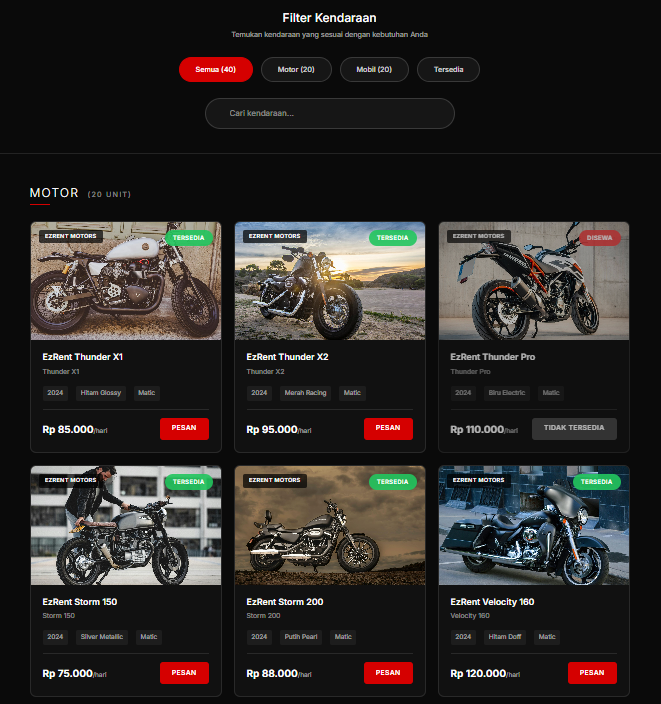
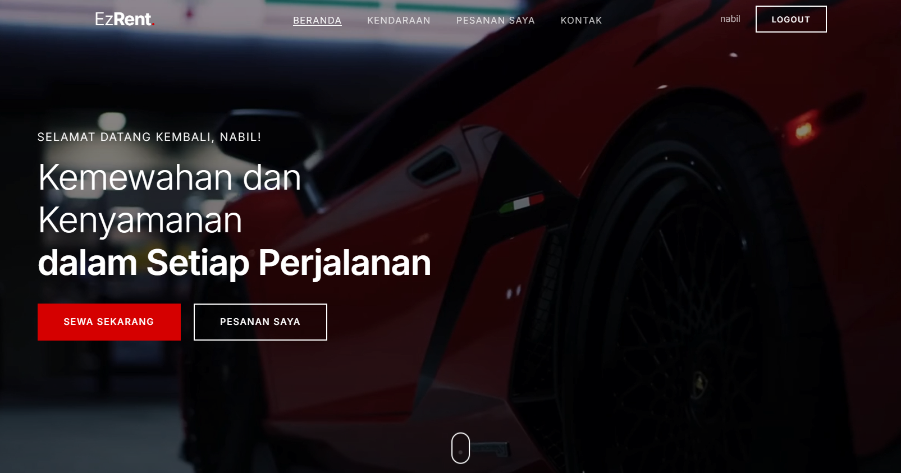

# EZRent

_EZRent_ adalah platform web untuk memudahkan proses sewa-menyewa properti secara online antara pemilik dan penyewa. Sistem ini dibangun menggunakan PHP sebagai backend utama, didukung CSS dan JavaScript untuk tampilan dan pengalaman pengguna yang interaktif.

---

## 📝 Deskripsi Singkat Proyek

EZRent memungkinkan pengguna untuk mencari, memasang, dan mengelola penyewaan properti (seperti rumah, apartemen, atau kamar). Sistem ini menyediakan dashboard untuk pemilik, penyewa, serta admin, sehingga aktivitas transaksi dapat dimonitor dan diatur secara transparan dan mudah.

---

## ✨ Fitur-Fitur Utama

### Pengguna Umum
- **Registrasi & Login**  
  Pengguna dapat membuat akun baru dan masuk. Otentikasi dilakukan menggunakan email dan password.
- **Pencarian Properti**  
  Cari properti berdasarkan lokasi, harga, tipe, dan fitur spesifik.
- **Detail Properti**  
  Lihat detail tiap properti: deskripsi, harga sewa, foto, fasilitas, dan kontak pemilik.
- **Pemesanan Sewa/Booking**  
  Booking properti secara langsung dan periksa status permohonan sewa.
- **Manajemen Profil**  
  Edit data diri & riwayat transaksi.

### Pemilik Properti (Owner)
- **Tambah Iklan Properti**  
  Unggah properti baru lengkap dengan foto, harga, dan deskripsi.
- **Edit & Hapus Properti**  
  Atur data properti yang sudah diunggah.
- **Melihat Daftar Penyewa**  
  Lihat daftar permohonan/penyewa yang masuk untuk properti miliknya.
- **Riwayat & Status Sewa**  
  Melihat status pembayaran dan persetujuan atas sewa.

### Admin
- **Dashboard Admin**  
  Monitor aktivitas seluruh pengguna, manajemen user, properti, dan transaksi.
- **Manajemen User**  
  Aktifkan/nonaktifkan user, menghapus properti bermasalah, dst.
- **Manajemen Transaksi**
  Lihat riwayat semua transaksi, approve/disapprove, laporan.

### Fitur Lain
- **Email Notification:** Notifikasi booking/pembayaran via email (jika sudah diaktifkan).
- **Responsive Layout:** Tampilan mobile-friendly.

---

## ⚙️ Cara Menjalankan Website (Setup)

### 1. Clone Repository

```bash
git clone https://github.com/njhbil/ezrent.git
```

### 2. Setup Database

- Buat database baru di MySQL, misal: `ezrent`.
- Import file SQL (misal `ezrent.sql` di folder `database/`) melalui phpMyAdmin atau command line:
  ```
  mysql -u root -p ezrent < database/ezrent.sql
  ```

### 3. Konfigurasi Koneksi Database

- Buka file konfigurasi database (contoh: `config/db.php` atau `config.php`).
- Edit parameter dengan data database lokal Anda:
  ```php
  $host = "localhost";
  $user = "root";
  $pass = "";
  $dbname = "ezrent";
  ```

### 4. Jalankan Web Server Lokal

- Pastikan sudah ada PHP dan MySQL (XAMPP, Laragon, MAMP, dsb).
- Salin folder hasil clone ke `htdocs` (XAMPP) atau `www` (Laragon/MAMP).
- Start Apache & MySQL.

### 5. Akses Aplikasi

- Buka browser dan kunjungi [http://localhost/ezrent](http://localhost/ezrent).

### 6. Akun Default (Optional)

Biasanya ada akun default untuk login ke sistem:
- **Admin:**  
  - Email: admin@ezrent.com  
  - Password: admin123  
- **Owner/Penyewa:**  
  - Register akun baru secara mandiri.

---

## 🖼️ Screenshot Tampilan Website

### Halaman Utama (Homepage)


### Halaman Daftar Properti


### Detail Properti


### Dashboard Admin


### Dashboard User

---

**Catatan:**  
Letakkan file gambar screenshot pada folder `screenshots/` dengan nama file sesuai contoh di atas.  
Tambahkan screenshot lain sesuai kebutuhan, terutama untuk fitur utama.

---

## 💡 Teknologi yang Digunakan

- **Backend:** PHP (native/framework)
- **Database:** MySQL/MariaDB
- **Frontend:** HTML5, CSS3, JavaScript
- **Library/Framework Frontend:** (Opsional) Bootstrap, jQuery
- **Web Server:** Apache
- **Ekstensi:** PHPMailer (opsional, untuk email notifikasi)

---

## 🙏 Kontribusi & Lisensi

Silakan fork repository ini untuk pengembangan lebih lanjut.  
Lisensi dan hak cipta menyesuaikan kebutuhan tugas/project.

---

Selamat menggunakan EZRent, semoga bermanfaat bagi Anda! 🚀
